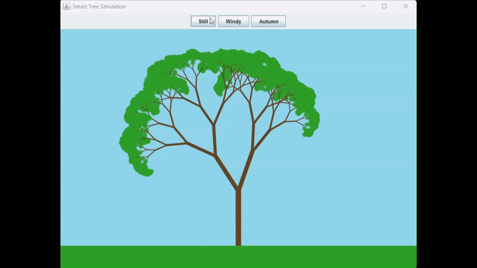

# 🌳 Procedural Tree & Particle Ecosystem


A real-time interactive ecosystem simulation built from scratch in core Java (Swing/AWT). It uses **Recursive Algorithms** to procedurally generate an organic, fractal tree, and features a custom **Particle System** combined with trigonometric physics to simulate wind and falling leaves.

## 🎥 Ecosystem in Action



## ✨ Key Features & Mechanics

- **Procedural Fractal Tree:** Uses recursion and seeded randomness (to maintain structure while ensuring organic asymmetry) to draw the tree dynamically.
- **State Machine Logic:** Seamlessly transition between three states:
  - **Still:** The tree stands tall and generates its leaves.
  - **Windy:** Applies sine-wave mathematical offsets to angles, simulating realistic wind propagation from the roots to the tips.
  - **Autumn (Solgun):** Triggers the Particle System.
- **Custom Particle System:** When autumn arrives, the tree calculates the exact endpoint of every branch, converts them into `Leaf` objects, and applies gravity and wind vectors to simulate realistic falling leaves piling up on the ground.
- **60 FPS Rendering:** Smooth animation engine built without any external game libraries.

## 💻 How to Run

1. Clone the repository and compile the Java file:
   ```bash
   git clone [https://github.com/0zan0cak/Procedural-Tree-Simulation.git](https://github.com/0zan0cak/Procedural-Tree-Simulation.git)
   javac TreeSimulator.java
   ```
